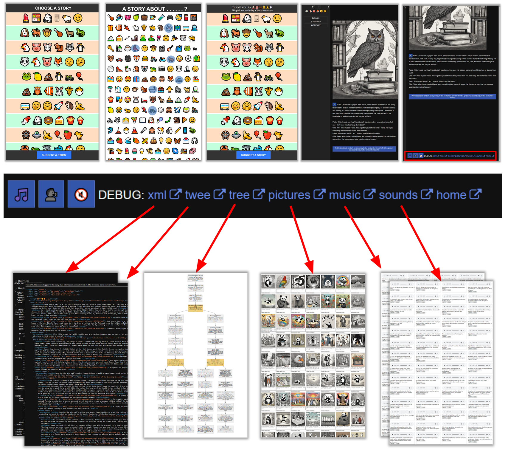
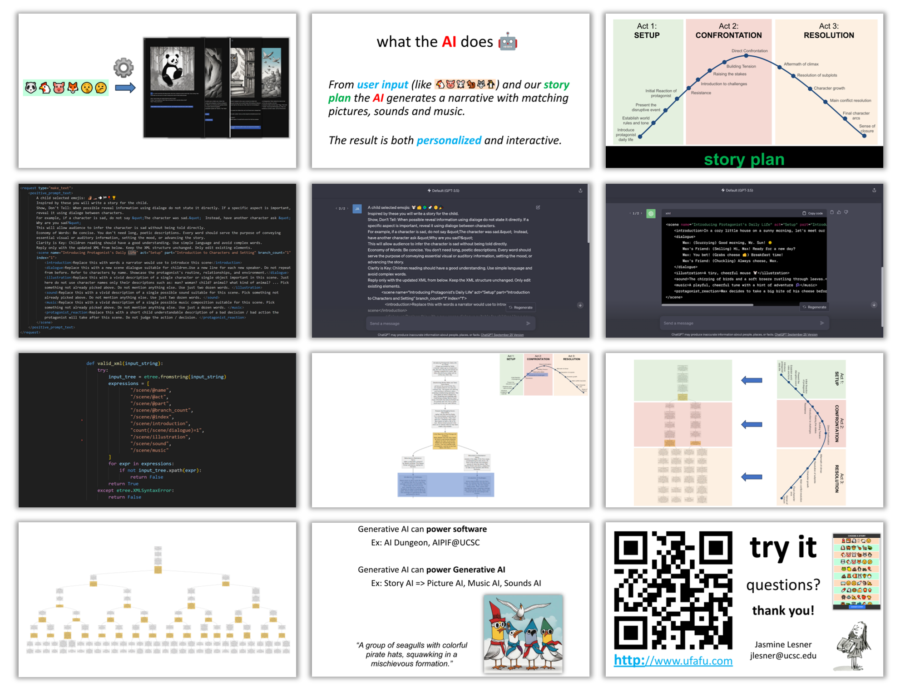

# CONCEPT => [DEMO SLIDES](https://docs.google.com/presentation/d/e/2PACX-1vQEWpCd9rHw_nf3z8NwHst0oOntTuaGIxebmH2r4SJwz3Ssi7kKm19cR8xOb36DqljtyWZ15cL_KNCZ/pub?start=true&loop=true&delayms=3000) 

# PROTOTYPE => [TRY IT!](http://ufafu.com) 

# MECHANISM => [PRESENTATION SLIDES](https://docs.google.com/presentation/d/e/2PACX-1vT9OusSkHbOU1f3sRQi1LRLuh0QPsd0Mq38jS_FgIOabma__D0oo9390NqoR5efjg/pub?start=true&loop=true&delayms=3000)

# AI Personalized Interactive Fiction
## Team

Luke / Tony / Jasmine / Poom

## Overview

AI personalized “choose your way” adventures (words + pictures + music + sounds) for children four to eight years old.

## How it works
1. Pick things your child likes.
2. Review / edit / approve the generated “Choose your way” adventure.
3. “Educate your child while they are entertained.”

## Theme

AI as a teacher through interactive fiction.

## Novelty

* Countless storylines can be generated and combined allowing parents pick ones that will best entertain and educate their child. 
* AI crafted stories can explore unique topics that writers have not yet thought about. 
* Personalized interactive fiction lets a child practice making decisions and see consequences.

## Value

“Interactive stories about your child’s favorite things personalized for the things you wish to teach your child.”

Entertain your child
* Child’s favorite characters, toys, foods
* Child’s favorite music and sounds

Educate your child
* Morals / street smarts / academics / what if..
* Common mistakes (watch out!)

## Technology
* Generative Artificial Neural Networks
* Stable Diffusion: Pictures / Music / Sounds
* Large Language Models (LLMs)
